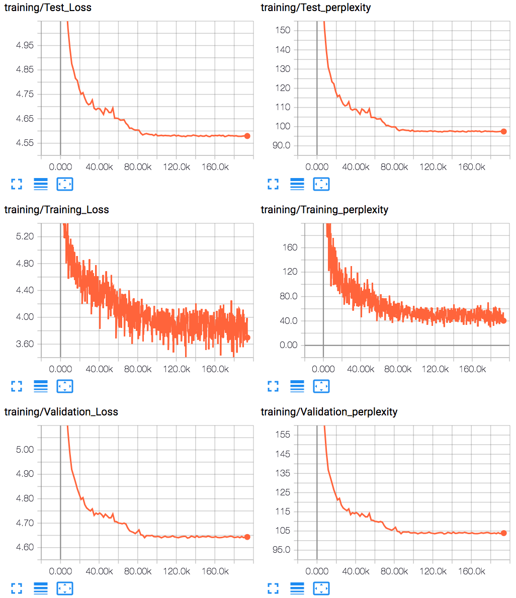

## Language Modeling
A language model (LM) is a probability distribution over a sequence of words. Given a sequence, a trained language model can provide the probability that the sequence is realistic. Using deep learning, one manner of creating an LM is by training a neural network to predict the probability of occurrence of the next word (or character) in the sequence given all the words (or characters) preceding it. (In other words, the joint distribution over elements in a sequence is broken up using the chain rule.) 

This folder contains scripts that implement a word-level language model using Temporal Convolutional Network (TCN) as described in the paper [An Empirical Evaluation of Generic Convolutional and Recurrent Networks for Sequence Modeling](https://arxiv.org/abs/1803.01271) by Shaojie Bai, J. Zico Kolter and Vladlen Koltun. In this paper, the 
authors show that TCNs architectures perform comparably across a diverse set of discrete sequence
 tasks. For language modeling, it is shown that TCN's performance on two datasets (Penn Tree Bank
  and WikiText) is comparable to that of an optimized LSTM architecture (with recurrent and 
  embedding dropout, etc).


### Data Loading
* For the language modeling task, dataloader for the Penn tree bank (PTB) dataset (or the wikitext-103 dataset) can be imported as `from nlp_architect.data.ptb import PTBDataLoader, PTBDictionary`
* Note that the data loader automatically downloads the data if not already present. Please 
provide the location to save the data as an argument to the data loader.

### Training
* The base class that defines TCN topology can be imported as: 

    `from nlp_architect.models.temporal_convolutional_network import TCN`
    
 Note that this is only the base class which defines the architecture. For defining a full trainable model, inherit this class and define the methods `build_train_graph`, which should define the loss functions, and `run`, which should define the training method.
 
 For the language model, loss functions and the training strategy are implemented in `./mle_language_model/language_modeling_with_tcn.py`.
 
 To train the model using PTB, use the following command:
 ```bash
 python ./mle_language_model/language_modeling_with_tcn.py --batch_size 16 --dropout 0.45 --epochs 100 --ksize 3 --levels 4 --seq_len 60 --nhid 600 --em_len 600 --em_dropout 0.25 --lr 4 --grad_clip_value 0.35 --results_dir ./ --dataset PTB
```
 
 The following tensorboard snapshots shows the result of a training run; plots for the training loss, perplexity, validation loss and perplexity are provided. With TCN, we get word perplexity of 97 on the PTB dataset.



### Inference

To run inference and generate sample data, run the following command:

```bash
 python ./mle_language_model/language_modeling_with_tcn.py --dropout 0.45 --ksize 3 --levels 4 --seq_len 60 --nhid 600 --em_len 600 --em_dropout 0.25 --ckpt <path to trained ckpt file> --inference --num_samples 100
```
Using the provided trained checkpoint file, this will generate and print samples to stdout.
Some sample "sentences" generated using the PTB are shown below:

```text
over a third hundred feet in control of u.s. marketing units and nearly three years ago as well as N N to N N has cleared the group for $ N and they 're the revenue of at least N decade a <unk> <unk> electrical electrical home home and pharmaceuticals was in its battle mr. <unk> said

as <unk> by <unk> and young smoke could follow as a real goal of writers 

<unk> <unk> while <unk> fit with this plan to cut back costs

about light trucks

more uncertainty than recycled paper people 

new jersey stock exchanges say i mean a <unk> <unk> part of those affecting the <unk> or female <unk> reported an <unk> of photographs <unk> and national security pacific

<unk> and ford had previously been an <unk> <unk> that is the <unk> taping of <unk> thousands in the <unk> of <unk> fuels

<unk> and <unk> tv paintings

book values of about N department stores in france
```
   


